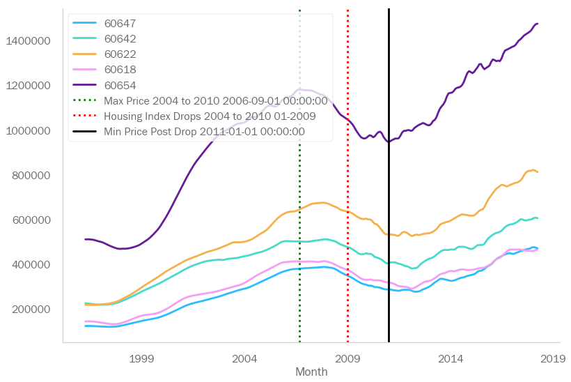
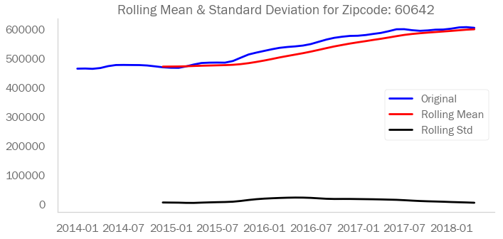
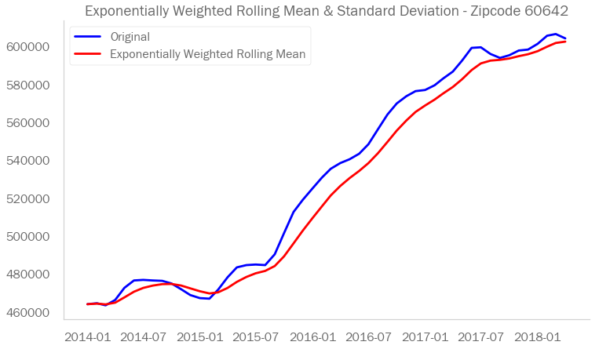
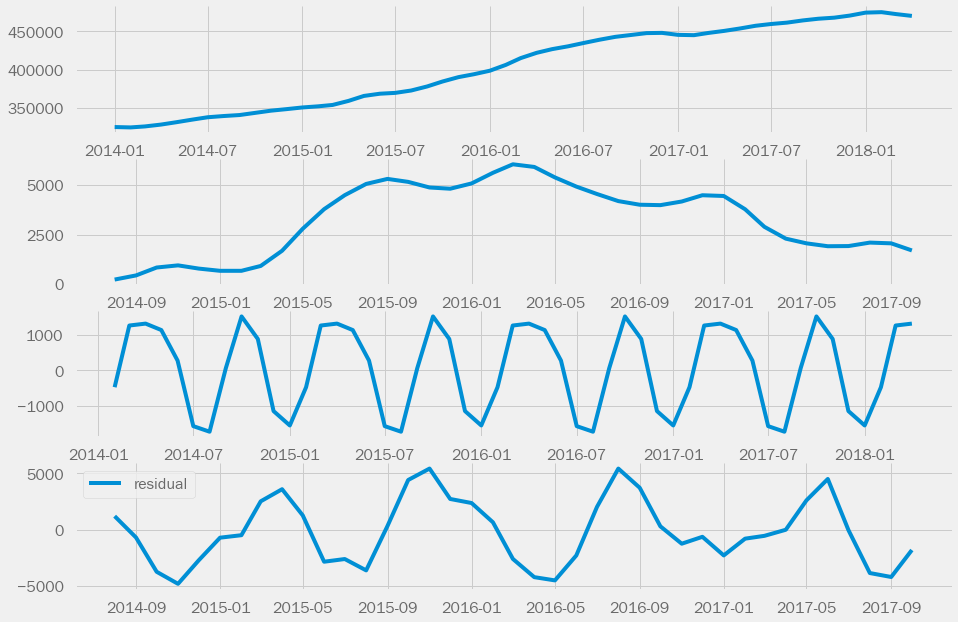
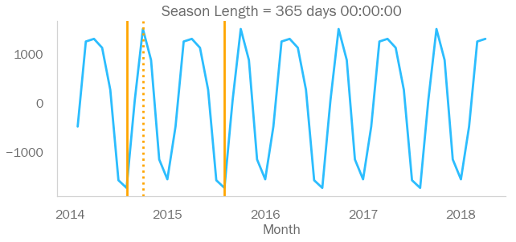
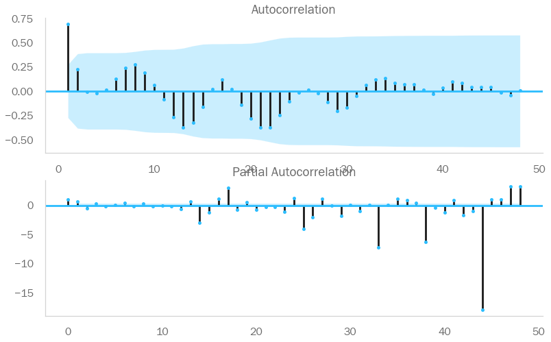
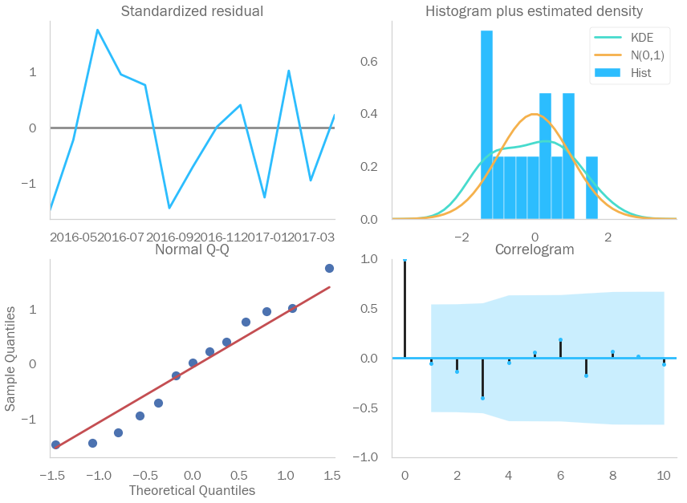
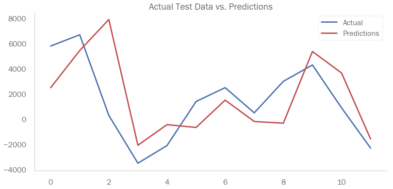
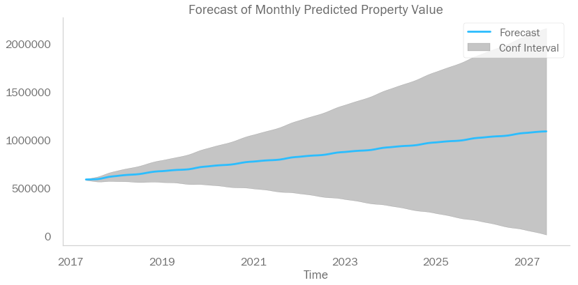

# Predict with Zillow the top 5 US Postcodes to invest in from 2018-04

The Main Goal of this project is to provide analysis and predictions for investing in U.S real estate given the investor's risk and investment profile.

The Data Analysed is provided by Zillow and represents U.S monthly sales data by region, state and zipcode for the periods 1996-04 - 2018-04.

The Target is to predict for the real estate investor the top 5 postcodes to invest in from 2018-04

The Pre-requisites being the real estate investor would like to focus on investing in the city of Chicago. The subset of zipcodes to invest in are those zipcodes that

1] Did not decrease in value by more than the average mean ROI for Chicago zipcodes during the U.S property market crash environ January 2009.

2] Further had the highest ROI in the period following the crash.

3] The real estate investor, according to their risk profile, believe that this would help reduce the risk that any steep increase in property price following the crash did not reflect a steep decrease during the crash period.

# Main Project Files
Time Series main module :  TimeSeries.ipynb
Data File:  zillow_data.csv

## Visualise Data

## Zipcode Selection
Examine Data - Property Market - Post Crash
take the top 5 zipcodes for highest ROI% in data_pre_crash_chicago (those zipcodes that were stable
according to the investor pre-requisite, having a ROI during the crash > overall mean for Chicago in this period)

## Model Example Zipcode: 60642

### Rolling Statistics
Plot the zipcode's returns with their respective rolling mean and rolling standard deviation.
Visually test for stationarity.

### Validate Stationarity
Check for stationarity, important for forecasting.

ADFuller test p-value for zipcode: 60642
p-value: 0.7710955432911607
p-value: (-0.9499014278779617, 0.7710955432911607, 6, 45, {'1%': -3.584828853223594, '5%': -2.9282991495198907, '10%': -2.6023438271604937}, 723.7310545354525)
Fail to reject the null hypothesis. Data is not stationary.

The Data is not stationary, attempt to remove trends.

### Remove Trends
Take a look at rolling mean and rolling std now after differencing with Exponentially weighted rolling mean.

After attempting to remove trends through differencing, subtracting the mean the data is not stationary. Use SARIMA model setting enforce_stationarity=False

### Seasonal Decomposition

### Seasonal Plot

## ACF/PACF

Behaviour of the ACF and PACF for ARMA Models

ACF

Tails off at AR(p)
Cuts off after lag q MA(q)
Tails off ARMA (p,q)
PACF

Cuts off after lag p AR(p)
Tails off MA(q)
Tails off ARMA (p,q)

## Fit SARIMA model and get results

## Train Predicted Results

## Test Predicted Results

## Forecast Model

Predicted property mean value at initial investment date 2017-05: 589678.76
Predicted property mean value in 1 year: 640020.38 is 8.54 %ROI
Predicted property mean value in 3 years: 739309.23 is 25.37 %ROI
Predicted property mean value in 5 years: 838673.62 is 42.23 %ROI
Predicted property mean value in 10 years: 1087181.87 is 84.37 %ROI

## Final Analysis of 5 Zipcodes

## Recommendations
The results were based on the sales data of zipcodes extracted to suit the pre-requisites of the investors risk profile This analysis may be adjusted to analyse data of a number of permutations of risk profiles including for example:

Overall country data, by city, state or region code
At different time periods including the full time period
Analysis of the seasonal patterns according to the rolling mean can be used to decide the entry point of investment, for example, some zipcodes showed a strong investment entry strategy at the beginning of each year and some showed more than one strong investment entry point at the beginning and mid year. All 5 postcodes showed a seasonality on monthly rolling period of 365 days.

The monthly rolling mean period can be extended to n days, n months, n years, depending on the amount of data being analysed versus prediction power, in order to further remove trends and increase stationarity of data.

Sue Mir / Flatiron Data Science Course / September 2020
